# System Architecture

## Overview

SpamSentry is a full-stack automated threat analysis system designed to detect spam across multiple communication channels (Email, URL, SMS). It uses a specialized machine learning backend and a modern React frontend, integrated with Supabase for secure authentication and history tracking.

```mermaid
graph TD
    subgraph "Client Layer"
        User[User]
        FE[Frontend (React + Vite)]

        User -->|Interacts| FE
    end

    subgraph "Backend Layer"
        API[ML Service (FastAPI)]
        Auth[Supabase Auth]
        DB[(Supabase DB)]

        FE -->|REST API (Analysis)| API
        FE -->|Auth & History| Auth
        FE -->|Store Results| DB
    end

    subgraph "Machine Learning Core"
        Router{Model Router}
        ModelEmail[Email Model (TF-IDF + SVC)]
        ModelURL[URL Model (TF-IDF + SVC)]
        ModelSMS[SMS Model (TF-IDF + SVC)]

        API --> Router
        Router -->|type='email'| ModelEmail
        Router -->|type='url'| ModelURL
        Router -->|type='sms'| ModelSMS
    end
```

## Component Details

### 1. Frontend (Client)

- **Tech Stack**: React, TypeScript, Vite, Tailwind CSS.
- **Design System**: "Swiss/Editorial" aesthetic with Framer Motion animations.
- **Key Features**:
  - Real-time threat analysis interface.
  - Multi-model selection (Email / URL / SMS).
  - secure authentication flow.
  - User history dashboard.

### 2. ML Service (Backend)

- **Tech Stack**: Python, FastAPI, Scikit-learn, Joblib.
- **Function**:
  - Exposes REST endpoints for prediction (`/api/predict`).
  - Loads three distinct ML models into memory at startup for low-latency inference.
  - Routes requests to the appropriate model based on user selection.
  - Returns prediction ("SPAM" or "HAM") and a confidence score.
- **Models**:
  - **Email**: Optimized for long-form text and email headers.
  - **URL**: feature extraction from malicious link patterns.
  - **SMS**: Tuned for short, informal text patterns.

### 3. Supabase (Infrastructure)

- **Authentication**: JWT-based user session management.
- **Database (PostgreSQL)**:
  - Stores user scan history.
  - Row Level Security (RLS) ensures users only see their own data.
  - **Schema**: `id`, `user_id`, `text`, `result`, `confidence`, `model_type`, `created_at`.

## Data Flow: Analysis Request

```mermaid
sequenceDiagram
    participant U as User
    participant FE as Frontend
    participant API as ML API
    participant M as ML Model
    participant DB as Supabase

    U->>FE: Selects type (e.g., SMS) & enters text
    U->>FE: Clicks "Execute Analysis"

    rect rgb(20, 20, 20)
        Note right of FE: Analysis Phase
        FE->>API: POST /api/predict {text, model_type}
        API->>M: Vectorize & Predict
        M-->>API: Result (Spam/Ham, Confidence)
        API-->>FE: JSON Response
    end

    rect rgb(30, 30, 40)
        Note right of FE: Persistence Phase
        FE->>DB: INSERT into 'history' table
        DB-->>FE: Success
    end

    FE-->>U: Display Result & Update Logs
```



## Directory Structure

```
SpamDetection/
├── frontend/             # React application
│   ├── src/
│   │   ├── pages/        # Route components (Scanner, Dashboard)
│   │   └── lib/          # Supabase client setup
│   └── database_schema.sql
├── ml_service/           # Python API
│   ├── main.py           # FastAPI app & routing logic
│   ├── models/           # SERIALIZED MODELS (.pkl)
│   └── .venv/            # Python virtual environment
├── start.sh              # Universal startup script
└── stop.sh               # Graceful shutdown script
```
