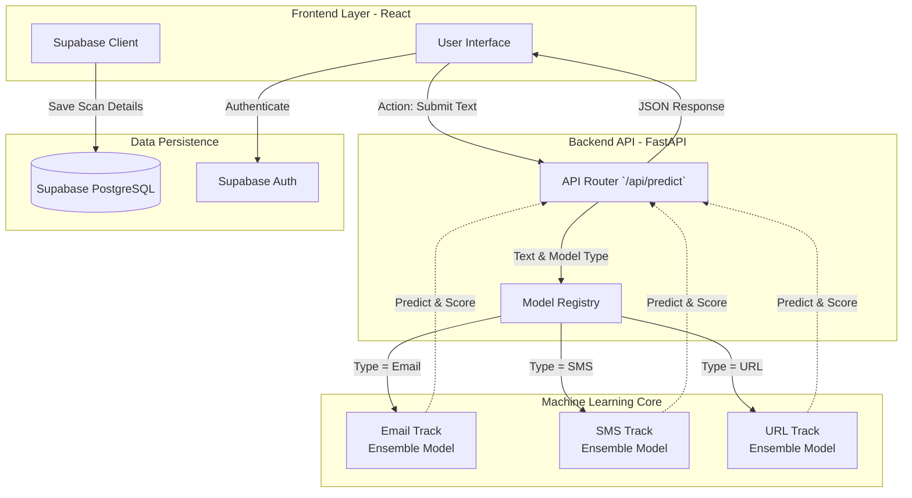

# SpamSentry: Comprehensive Project Documentation & Architecture Guide

This document is a complete architectural and technical reference for the **SpamSentry** project. It is intended for engineering teams mapping out the system architecture, creating UML diagrams, or understanding the machine learning data flows and performance metrics.

---

## 🏗️ 1. High-Level System Architecture

SpamSentry is a secure, full-stack threat analysis system that detects spam and phishing attempts across three distinct channels: Emails, URLs, and SMS messages.



### Complete Tech Stack

| Layer                | Technology                     | Purpose                                                  |
| :------------------- | :----------------------------- | :------------------------------------------------------- |
| **Frontend**         | React 18, Vite, TypeScript     | Component-based UI rendering and fast builds.            |
| **Styling**          | Tailwind CSS, Framer Motion    | Neo-Brutalist aesthetics, responsive design, animations. |
| **Backend API**      | Python 3.10+, FastAPI, Uvicorn | High-performance asynchronous REST API.                  |
| **Logic/ML Core**    | Scikit-learn, joblib, pandas   | Vectorization, Model Inference, data handling.           |
| **Database**         | Supabase (PostgreSQL)          | Stores authentication tokens and persistent history.     |
| **Containerization** | Docker, Docker Compose         | Orchestrates the `frontend` and `ml_service` containers. |

---

## 🔄 2. Data Flow & Request Lifecycle

This section describes the end-to-end data flow when a user initiates a threat analysis.

```mermaid
sequenceDiagram
    participant User
    participant Frontend as React Client
    participant API as FastAPI Backend
    participant ML as Joblib Model
    participant Supabase as PostgreSQL DB

    User->>Frontend: Selects track (Email) and enters text
    Frontend->>API: POST /api/predict {text, model_type}

    rect rgb(30, 40, 50)
        Note right of API: Machine Learning Phase
        API->>ML: Pass text to `email_vectorizer`
        ML-->>API: Numpy TF-IDF Array
        API->>ML: Pass array to `email_model`
        ML-->>API: 'SPAM' and Confidence (e.g. 0.952)
    end

    API-->>Frontend: JSON: {prediction: SPAM, confidence: 0.952}

    rect rgb(10, 50, 20)
        Note right of Frontend: Persistence Phase
        Frontend->>Supabase: INSERT into `history` table
        Supabase-->>Frontend: 201 Created (Success)
    end

    Frontend-->>User: Visualizes outcome via UI animations
```



### API Specification

The prediction API is an asynchronous FastAPI endpoint:

- **Endpoint:** `POST /api/predict`
- **Request Body (JSON):**
  ```json
  {
    "text": "Win a free $1000 Walmart gift card!",
    "model_type": "url" // Must be "email", "sms", or "url"
  }
  ```
- **Response Body (JSON):**
  ```json
  {
    "prediction": "SPAM", // "SPAM" or "HAM"
    "confidence": 0.8851, // Float indicating model certainty
    "is_spam": true, // Boolean for frontend conditional rendering
    "model_type": "url" // Echoes the selected track
  }
  ```

---

## 🧠 3. Machine Learning Infrastructure & Algorithms

The SpamSentry backend abandons simple keyword matching in favor of a robust **Voting Classifier Ensemble**, allowing it to synthesize multiple algorithmic perspectives into a single highly calibrated prediction.

### The Algorithm Pipeline (The "Ensemble")

For all three tracks, the system uses a **Soft Voting Classifier** containing three distinct base estimators:

1. **Logistic Regression:** Linear mapping that provides highly calibrated class probabilities.
2. **Multinomial Naive Bayes (MNB):** Excellent for discrete text/word counts; offers a rapid generative approach.
3. **Linear Support Vector Classifier (LinearSVC):** Configured with `CalibratedClassifierCV(method="sigmoid")` to allow maximum-margin optimization while still returning confidence percentages instead of raw decision boundaries.

### Text Vectorization Config (Anti-Overfitting)

Prior to inference, the raw string is mathematically tokenized using `TfidfVectorizer`:

- **Word-Level N-grams (Emails & SMS)** or **Character-Level N-grams (URLs)**.
- `sublinear_tf=True` (Logarithmically scales term frequency to ignore redundant spam words).
- `max_df=0.95` (Strips out corpus-specific words that appear in > 95% of the entries).

---

## 📊 4. Training Pipeline, Data Splits, and Evaluation

The model was iteratively trained (`ml_service/train_models.py`) against diverse real-world datasets and synthetically injected "Modern Ham" (e.g., OTP codes, bank alerts) and "Modern Spam" (e.g., KYC phishing links) to prevent false positives on modern alerts.

### Datasets Utilized

| Track     | Dataset Source                     | Data Size (Capped) |
| :-------- | :--------------------------------- | :----------------- |
| **Email** | `SetFit/enron_spam` (Hugging Face) | 25,660 Records     |
| **URL**   | `Mitake/PhishingURLsANDBenignURLs` | 40,390 Records     |
| **SMS**   | UCI SMS Spam Collection            | 6,234 Records      |

### Train/Test Split & Cross-Validation

- **80/20 Stratified Split**: 80% used for ensemble training, 20% strictly reserved for unseen testing evaluating (via `test_size=0.2`).
- **Target Stratification**: The ratio of Spam to Ham was mathematically maintained across both the training and testing sets.
- **K-Fold CV**: 5-Fold Stratified Cross-Validation (`cv=5`) was executed on the _training_ sets to ensure the models were not implicitly memorizing data clumps.

### 🏆 Final Model Evaluation Metrics (Test Set)

The models achieved the following performance metrics on the unseen 20% test split:

| Model Track     | Dimensionality (Features) | Test Accuracy | F1-Score   | K-Fold CV Mean |
| :-------------- | :------------------------ | :------------ | :--------- | :------------- |
| **Email Model** | 20,000 Words              | **99.22%**    | **0.9922** | 99.01% ± 0.002 |
| **SMS Model**   | 4,077 Words               | **98.48%**    | **0.9845** | 98.64% ± 0.004 |
| **URL Model**   | 15,000 Characters         | **93.09%**    | **0.9304** | 92.70% ± 0.003 |

---

## 🗄️ 5. Database Schema & State Management

The frontend pushes history logs securely to Supabase. This schema relies on Supabase Row-Level Security (RLS) to ensure users can only ever `SELECT` and `INSERT` records matching their own authenticated `user_id`.

**Table:** `history`

```sql
CREATE TABLE history (
    id UUID DEFAULT uuid_generate_v4() PRIMARY KEY,
    user_id UUID REFERENCES auth.users(id), -- Binds record to authenticated user
    text TEXT NOT NULL,                     -- The raw payload entered
    result VARCHAR(10) NOT NULL,            -- "SPAM" or "HAM"
    confidence DECIMAL(5,4),                -- e.g., 0.9920
    model_type VARCHAR(20),                 -- "email", "sms", or "url"
    created_at TIMESTAMP WITH TIME ZONE DEFAULT NOW()
);
```

### UML Advice

For teammates generating Object-Oriented or UML Diagrams:

1. Treat the `FastAPI Server` as a Singleton process that instantiates a `Dict` of loaded predictors on startup (`load_models()`).
2. Map the Frontend state through the React Context API / Supabase Auth tokens.
3. Keep the `Vectorization` and `Classification` operations tightly coupled internally within the Python service, returning only primitive DTOs (Data Transfer Objects) back over HTTP.